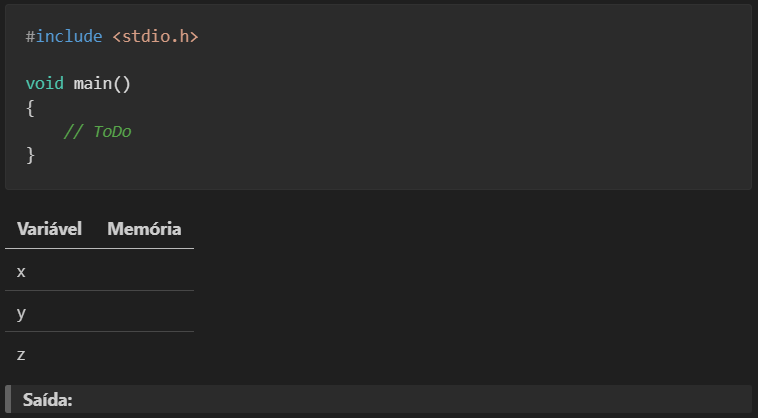
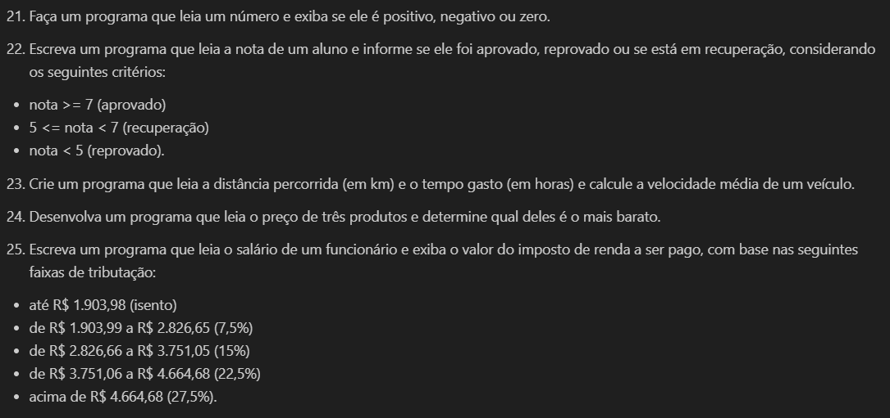

<h1 align="center">
  Listas de Exercícios
</h1>

<h4 align="center">Disciplina SI100 - Algoritmos e Programação de Computadores I</h4>

- Lista 1 ([download ToDo](Lista1_ToDo.md) / [download ToPrint](Lista1_ToPrint.pdf))
    - Algoritmos e Fluxogramas
    - Tipos de Dados, Constantes, Variáveis e Printf (valor, endereço e tamanho)
    - Scanf e Precedência de Operadores (atribuição, aritmético, incremento, decremento, relacionais, lógicos)
    - Estruturas de decisão (if, switch)
    - Estruturas de repetição (for, while, do-while)

- Lista 2
    - Em desenvolvimento....

## Tipos de Downloads

1. **ToDo - para salvar suas respostas:**

    São arquivos markdown (MD) editáveis para salvar suas respostas durante os estudos. Entre cada atividade existem espaços reservados para as respostas:

    

 

2. **ToPrint - para imprimir:**

    São arquivos PDF para facilitar a leitura e compartilhamento das atividades. Não há espaço entre os enunciados de cada atividade:

    
